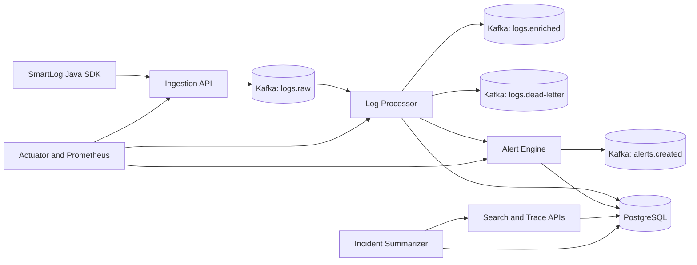

# SmartLog

SmartLog is a Java 21 and Spring Boot 3 observability platform for centralized microservice logging, request correlation, trace reconstruction, alerting, analytics, and local AI incident summarization.

It accepts structured logs from services, processes them through an asynchronous ingestion pipeline, persists enriched events in PostgreSQL, and exposes REST APIs for log search, distributed trace timelines, root-cause detection, alerts, and incident summaries.

## Features

- Structured log ingestion through single and batch REST APIs.
- Kafka-based ingestion with an in-memory queue option for local development.
- PostgreSQL persistence managed by Flyway migrations.
- Idempotent log writes using `eventId`.
- Log enrichment with message hashes, exception fingerprints, severity scores, ingestion delay, and error flags.
- PII masking for sensitive attributes and stack trace values before persistence.
- Dead-letter persistence for malformed Kafka events.
- Search APIs with service, level, time range, keyword, correlation, trace, user, and transaction filters.
- Distributed trace timeline reconstruction by `correlationId`, `transactionId`, or `userId`.
- Rule-based root-cause detection with confidence and supporting events.
- Sliding-window alert generation for service-level error spikes.
- Analytics for top recurring errors, top exceptions, and service error rate.
- Provider-neutral AI incident summarization through an `LlmClient` interface and local `MockLlmClient`.
- Prometheus metrics, Grafana dashboard, k6 load test, and sample log generator.
- Lightweight Java SDK package for emitting logs from Java services.

## Architecture



The application currently runs as a single Spring Boot service with clear package boundaries for ingestion, processing, storage, query, trace, alerting, analytics, AI incident summarization, and SDK code.

## Tech Stack

- Java 21
- Spring Boot 3
- Maven
- PostgreSQL
- Flyway
- Apache Kafka
- Spring JDBC
- Spring Kafka
- Spring Boot Actuator
- Micrometer and Prometheus
- Grafana
- JUnit 5 and H2 for tests
- k6 for load testing

## Repository Layout

```text
src/main/java/com/smartlog
  ai/                 AI incident summarizer
  alerting/           Alert engine, alert APIs, alert persistence
  analytics/          Top errors, top exceptions, error-rate APIs
  common/             Shared models, enums, exceptions
  demo/               Demo trade transaction flow
  ingestion/          REST ingestion, Kafka publishing, queue pipeline
  processing/         Kafka consumers, enrichment, masking, dead letters
  query/              Log search APIs
  sdk/                Java client SDK
  storage/            JDBC repositories
  trace/              Trace timeline and root-cause APIs

src/main/resources/db/migration/postgresql
src/test/resources/db/migration/h2
docs/
load-tests/
monitoring/
scripts/
docker-compose.yml
```

## Quick Start

### Prerequisites

- JDK 21 or newer
- Maven 3.9+
- Docker and Docker Compose

### Run Tests

```bash
mvn test
```

### Start Infrastructure

```bash
docker compose up -d postgres kafka kafka-init prometheus grafana
```

Kafka topics created by Docker Compose:

```text
logs.raw
logs.enriched
logs.dead-letter
alerts.created
```

### Run the Application

```bash
mvn spring-boot:run
```

The default ingestion mode is Kafka. For a faster local run without Kafka:

```bash
mvn spring-boot:run -Dspring-boot.run.arguments="--smartlog.ingestion.mode=in-memory"
```

### Service URLs

```text
Application:   http://localhost:8080
Health:        http://localhost:8080/actuator/health
Prometheus:    http://localhost:8080/actuator/prometheus
Swagger UI:    http://localhost:8080/swagger-ui/index.html
Prometheus UI: http://localhost:9090
Grafana:       http://localhost:3000
```

Grafana credentials:

```text
username: admin
password: smartlog
```

## Configuration

Main SmartLog configuration:

```yaml
smartlog:
  ingestion:
    mode: kafka
    pipeline:
      queue-capacity: 1000
      batch-size: 100
      worker-threads: 2
      poll-timeout: 200ms
      shutdown-timeout: 10s
    validation:
      max-payload-bytes: 262144
      max-stack-trace-chars: 12000
    rate-limit:
      enabled: false
      default-limit-per-window: 1000
      window: 1m
  kafka:
    publish-timeout: 5s
    topics:
      raw: logs.raw
      enriched: logs.enriched
      dead-letter: logs.dead-letter
      alerts-created: alerts.created
  alerting:
    error-threshold: 100
    window: 5m
  ai:
    llm-client: mock
```

In Kafka mode, ingestion returns `202 Accepted` after validation and publishing to `logs.raw`. Search and trace APIs can read the log after the consumer processes and persists it.

In in-memory mode, ingestion returns `202 Accepted` after the event is placed on the bounded queue. Search and trace APIs can read the log after the worker batch is flushed.

Backpressure behavior:

```text
429 Too Many Requests     In-memory queue full or rate limit exceeded
413 Payload Too Large     Payload or stack trace exceeds configured limit
503 Service Unavailable   Kafka publish failed in Kafka mode
```

## API Overview

### Ingestion

```http
POST /api/v1/logs
POST /api/v1/logs/batch
```

Example:

```bash
curl -X POST "http://localhost:8080/api/v1/logs" \
  -H "Content-Type: application/json" \
  -d '{
    "eventId": "evt-limit-9081",
    "timestamp": "2026-06-16T10:30:05Z",
    "serviceName": "limit-check-service",
    "environment": "dev",
    "level": "ERROR",
    "message": "Customer limit validation failed",
    "correlationId": "corr-12345",
    "traceId": "trace-abc",
    "spanId": "span-limit-001",
    "parentSpanId": "span-trade-001",
    "userId": "U1001",
    "transactionId": "TF-9081",
    "module": "LIMIT_VALIDATION",
    "exceptionType": "LimitExceededException",
    "attributes": {
      "customerId": "C1001",
      "limitType": "IMPORT_LC"
    }
  }'
```

Response:

```json
{
  "status": "ACCEPTED",
  "eventId": "evt-limit-9081",
  "acceptedAt": "2026-06-16T10:30:06Z"
}
```

### Log Search

```http
GET /api/v1/logs/search
```

Supported filters:

```text
serviceName
level
from
to
keyword
correlationId
traceId
userId
transactionId
page
size
```

Examples:

```bash
curl "http://localhost:8080/api/v1/logs/search?serviceName=limit-check-service&page=0&size=20"
curl "http://localhost:8080/api/v1/logs/search?level=ERROR&from=2026-06-16T10:00:00Z&to=2026-06-16T11:00:00Z"
curl "http://localhost:8080/api/v1/logs/search?traceId=trace-abc&userId=U1001&transactionId=TF-9081"
curl "http://localhost:8080/api/v1/logs/search?keyword=validation"
```

### Trace Timeline

```http
GET /api/v1/traces/{correlationId}
GET /api/v1/traces/{correlationId}?level=ERROR&serviceName=limit-check-service&includeStackTrace=true
GET /api/v1/traces/by-transaction/{transactionId}
GET /api/v1/traces/by-user/{userId}?limit=10
```

Trace responses include:

```text
correlationId
transactionId
userId
status
durationMs
highestSeverity
services
firstEventTime
lastEventTime
totalEvents
events
```

Stack traces are hidden by default and are returned only when `includeStackTrace=true`.

### Root Cause

```http
GET /api/v1/traces/{correlationId}/root-cause
```

The root-cause analyzer prioritizes serious failure signals in the trace. It returns the probable failing service, message, exception type, timestamp, transaction/user identifiers, confidence, reason, and supporting timeline events.

Confidence values:

```text
HIGH
MEDIUM
LOW
```

### Incident Summary

```http
POST /api/v1/traces/{correlationId}/incident-summary
GET  /api/v1/incidents/{alertId}/summary
```

Incident summaries are generated through the `LlmClient` interface. The default `mock` implementation is deterministic and does not require a paid provider.

Response fields:

```text
incidentSummaryId
correlationId
summary
probableCause
impactedServices
suggestedActions
confidence
summarizerType
createdAt
```

### Alerts

```http
GET /api/v1/alerts
GET /api/v1/alerts/{alertId}
```

Alerts are generated when ERROR or FATAL logs exceed the configured threshold within the configured sliding window.

### Analytics

```http
GET /api/v1/analytics/top-errors?window=10m&limit=5
GET /api/v1/analytics/top-exceptions?window=10m&limit=5
GET /api/v1/analytics/error-rate?serviceName=trade-service&window=10m
```

Top-K ranking is implemented with a HashMap plus PriorityQueue flow.

### Demo Flow

```http
POST /api/v1/demo/trade-transactions/success
POST /api/v1/demo/trade-transactions/fail-limit
```

These endpoints emit a small trade-finance style distributed trace through the normal ingestion path.

## Sample Trace Walkthrough

Ingest a batch of correlated events:

```bash
curl -X POST "http://localhost:8080/api/v1/logs/batch" \
  -H "Content-Type: application/json" \
  -d '{
    "logs": [
      {
        "eventId": "evt-auth-9081",
        "timestamp": "2026-06-16T10:30:01Z",
        "serviceName": "auth-service",
        "environment": "dev",
        "level": "INFO",
        "message": "User authenticated",
        "correlationId": "corr-12345",
        "traceId": "trace-abc",
        "spanId": "span-auth-001",
        "userId": "U1001",
        "transactionId": "TF-9081"
      },
      {
        "eventId": "evt-trade-9081",
        "timestamp": "2026-06-16T10:30:03Z",
        "serviceName": "trade-service",
        "environment": "dev",
        "level": "INFO",
        "message": "Trade transaction created",
        "correlationId": "corr-12345",
        "traceId": "trace-abc",
        "spanId": "span-trade-001",
        "parentSpanId": "span-auth-001",
        "userId": "U1001",
        "transactionId": "TF-9081"
      },
      {
        "eventId": "evt-limit-9081",
        "timestamp": "2026-06-16T10:30:05Z",
        "serviceName": "limit-check-service",
        "environment": "dev",
        "level": "ERROR",
        "message": "Customer limit validation failed",
        "correlationId": "corr-12345",
        "traceId": "trace-abc",
        "spanId": "span-limit-001",
        "parentSpanId": "span-trade-001",
        "userId": "U1001",
        "transactionId": "TF-9081",
        "exceptionType": "LimitExceededException"
      },
      {
        "eventId": "evt-workflow-9081",
        "timestamp": "2026-06-16T10:30:06Z",
        "serviceName": "workflow-service",
        "environment": "dev",
        "level": "WARN",
        "message": "Workflow stopped due to validation failure",
        "correlationId": "corr-12345",
        "traceId": "trace-abc",
        "spanId": "span-workflow-001",
        "parentSpanId": "span-limit-001",
        "userId": "U1001",
        "transactionId": "TF-9081"
      }
    ]
  }'
```

Query the trace and root cause:

```bash
curl "http://localhost:8080/api/v1/traces/corr-12345"
curl "http://localhost:8080/api/v1/traces/corr-12345/root-cause"
curl -X POST "http://localhost:8080/api/v1/traces/corr-12345/incident-summary"
```

## Java SDK Usage

```java
SmartLogClient smartLog = SmartLogClient.builder()
        .serviceName("limit-check-service")
        .environment("dev")
        .endpoint("http://localhost:8080/api/v1/logs")
        .build();

smartLog.error(
        "Customer limit validation failed",
        LogContext.builder()
                .correlationId("corr-12345")
                .traceId("trace-abc")
                .spanId("span-limit-001")
                .parentSpanId("span-trade-001")
                .userId("U1001")
                .transactionId("TF-9081")
                .module("LIMIT_VALIDATION")
                .attribute("customerId", "C1001")
                .build(),
        exception
);
```

The SDK sends logs asynchronously through a bounded local queue and retries transient send failures.

## Observability

Prometheus metrics are exposed at:

```http
GET /actuator/prometheus
```

Key metric names:

```text
smartlog_logs_accepted_total
smartlog_logs_rejected_total
smartlog_logs_persisted_total
smartlog_logs_failed_total
smartlog_ingestion_queue_size
smartlog_db_batch_inserts_total
smartlog_kafka_consumer_lag
smartlog_alerts_generated_total
```

Grafana provisioning files and dashboard JSON are included under `monitoring/grafana/`.

## Database

Production migrations:

```text
src/main/resources/db/migration/postgresql
```

Test migrations:

```text
src/test/resources/db/migration/h2
```

Managed tables:

```text
logs
alerts
incident_summaries
dead_letter_logs
service_registry
```

Important indexing paths include correlation, trace, user, transaction, service/time, level/time, message hash, exception fingerprint, and severity/time.

## Load Testing

Run the k6 ingestion load test:

```bash
k6 run load-tests/smartlog-ingestion.k6.js
k6 run -e BASE_URL=http://localhost:8080 -e VUS=10 -e DURATION=5m load-tests/smartlog-ingestion.k6.js
```

Record benchmark results in:

```text
docs/benchmarks.md
```

## Sample Data

Generate sample trade-finance logs:

```powershell
.\scripts\generate-sample-logs.ps1 -BaseUrl "http://localhost:8080" -Transactions 5
.\scripts\generate-sample-logs.ps1 -BaseUrl "http://localhost:8080" -Transactions 20 -ErrorSpike
```

## Documentation

- [ARCHITECTURE.md](ARCHITECTURE.md)
- [TECH_STACK.md](TECH_STACK.md)
- [API_CONTRACTS.md](API_CONTRACTS.md)
- [DATABASE_SCHEMA.md](DATABASE_SCHEMA.md)
- [docs/ai-incident-summarizer.md](docs/ai-incident-summarizer.md)
- [docs/benchmarks.md](docs/benchmarks.md)

## Development Notes

- Keep the application backend-only.
- Use Java 21 and Spring Boot 3 conventions.
- Keep schema changes in Flyway migrations.
- Prefer simple service-layer logic and explicit repository queries.
- Run `mvn test` before pushing changes.
