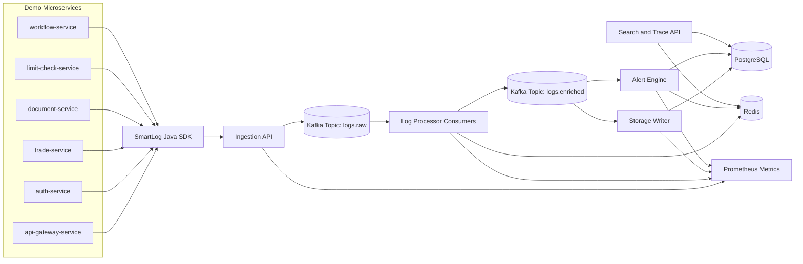

# SmartLog

**SmartLog** is an event-driven observability platform for microservices. It collects structured logs from many services, correlates them using `correlationId`, `traceId`, `spanId`, `userId`, and `transactionId`, reconstructs the complete request timeline, detects probable root causes, and raises alerts for error spikes.

This project is designed as a backend-only Java project for strong resume and interview impact. It is inspired by real-world centralized logging and observability systems such as ELK, Grafana Loki, Datadog Logs, Splunk, CloudWatch Logs, OpenTelemetry-style trace correlation, and internal enterprise monitoring platforms.

The target domain for the demo is a microservice-heavy banking/trade-finance style system, but the design works for e-commerce, fintech, payments, healthcare, SaaS, and cloud platforms.

---

## Current checkpoint status

Checkpoint 1 created the initial Java 21 Spring Boot 3 Maven application as a single runnable service with logical package boundaries for the future SmartLog modules.

Checkpoint 2 adds REST-first structured log ingestion. Logs are validated, assigned an event ID when missing, stamped with `receivedAt`, and stored directly in PostgreSQL through Spring JDBC. Kafka, search, trace reconstruction, alerting, analytics, SDK behavior, and UI are intentionally not implemented yet.

Current local commands:

```bash
mvn test
docker compose up -d postgres
mvn spring-boot:run
```

Health and API documentation endpoints:

```http
GET http://localhost:8080/actuator/health
GET http://localhost:8080/swagger-ui/index.html
```

Structured ingestion endpoints:

```http
POST http://localhost:8080/api/v1/logs
POST http://localhost:8080/api/v1/logs/batch
```

The code intentionally does not implement search, Kafka, alerting, or analytics yet. Those belong to later checkpoints in `GOAL.md`.

---

## 1. Problem statement

In a microservice application, one user action may pass through many services:

```text
api-gateway-service
  -> auth-service
  -> trade-service
  -> document-service
  -> limit-check-service
  -> workflow-service
  -> notification-service
```

When the final transaction fails, developers often need to manually inspect many different log files:

```text
auth-service.log
trade-service.log
document-service.log
limit-check-service.log
workflow-service.log
notification-service.log
```

This is slow and error-prone. The real failure may happen in one service, but the visible error may appear in another service. SmartLog solves this by collecting logs centrally and grouping them by request-level identifiers.

---

## 2. What SmartLog does

SmartLog provides these core capabilities:

1. Ingest structured logs from many microservices.
2. Process logs asynchronously using an event-driven pipeline.
3. Store logs in a searchable format.
4. Search by service, level, time range, keyword, user ID, transaction ID, trace ID, or correlation ID.
5. Reconstruct a full request timeline across services.
6. Identify the probable root-cause service for failed transactions.
7. Detect error spikes using sliding-window alerting.
8. Track top-K recurring errors and exceptions.
9. Apply rate limiting, backpressure, dead-letter handling, and idempotent writes.
10. Later, add an AI incident agent that summarizes failures and suggests remediation steps.

---

## 3. Key value proposition

SmartLog is not just a log storage app. It is a microservice log correlation and root-cause analysis platform.

Given a failed transaction such as:

```text
transactionId = TF-9081
```

SmartLog can return:

```text
10:30:01 api-gateway-service       INFO   Request received
10:30:02 auth-service              INFO   User authenticated
10:30:03 trade-service             INFO   Trade transaction created
10:30:04 document-service          INFO   Documents validated
10:30:05 limit-check-service       ERROR  Customer limit validation failed
10:30:06 workflow-service          WARN   Workflow stopped due to validation failure
10:30:07 notification-service      INFO   Failure notification queued
```

Probable root cause:

```text
limit-check-service: Customer limit validation failed
```

This is the main feature that makes the project real-world and interview-worthy.

---

## 4. High-level architecture



---

## 5. Main services and modules

Recommended monorepo structure:

```text
smartlog/
  README.md
  ARCHITECTURE.md
  TECH_STACK.md
  GOAL.md
  LLD.md
  API_CONTRACTS.md
  DATABASE_SCHEMA.md
  docker-compose.yml
  smartlog-common/
  smartlog-sdk/
  smartlog-ingestion-service/
  smartlog-processor-service/
  smartlog-query-service/
  smartlog-alert-service/
  smartlog-demo-services/
    api-gateway-service/
    auth-service/
    trade-service/
    limit-check-service/
    workflow-service/
  scripts/
  load-tests/
  docs/
```

For easier implementation, you can start as one Spring Boot application with packages for ingestion, processing, search, alerting, and storage. After the core logic works, split it into services.

---

## 6. Core entities

### LogEvent

Raw event sent by microservices.

```json
{
  "eventId": "evt-001",
  "timestamp": "2026-06-16T10:30:05Z",
  "serviceName": "limit-check-service",
  "environment": "dev",
  "level": "ERROR",
  "message": "Customer limit validation failed",
  "correlationId": "corr-12345",
  "traceId": "trace-abc",
  "spanId": "span-limit-001",
  "parentSpanId": "span-trade-001",
  "userId": "U1001",
  "transactionId": "TF-9081",
  "module": "LIMIT_VALIDATION",
  "exceptionType": "LimitExceededException",
  "stackTrace": "...",
  "attributes": {
    "customerId": "C1001",
    "limitType": "IMPORT_LC"
  }
}
```

### TraceTimeline

Grouped timeline for a single request.

```json
{
  "correlationId": "corr-12345",
  "transactionId": "TF-9081",
  "userId": "U1001",
  "status": "FAILED",
  "events": [
    {
      "timestamp": "2026-06-16T10:30:01Z",
      "serviceName": "auth-service",
      "level": "INFO",
      "message": "User authenticated"
    },
    {
      "timestamp": "2026-06-16T10:30:05Z",
      "serviceName": "limit-check-service",
      "level": "ERROR",
      "message": "Customer limit validation failed"
    }
  ]
}
```

### RootCauseResult

```json
{
  "correlationId": "corr-12345",
  "probableRootCauseService": "limit-check-service",
  "probableRootCauseMessage": "Customer limit validation failed",
  "exceptionType": "LimitExceededException",
  "confidence": "MEDIUM",
  "reason": "First ERROR event in the distributed request timeline"
}
```

---

## 7. Main API examples

### Ingest one log

```http
POST /api/v1/logs
```

```json
{
  "serviceName": "limit-check-service",
  "level": "ERROR",
  "message": "Customer limit validation failed",
  "correlationId": "corr-12345",
  "traceId": "trace-abc",
  "spanId": "span-limit-001",
  "parentSpanId": "span-trade-001",
  "userId": "U1001",
  "transactionId": "TF-9081",
  "exceptionType": "LimitExceededException"
}
```

Response:

```json
{
  "status": "ACCEPTED",
  "eventId": "evt-001",
  "acceptedAt": "2026-06-16T10:30:06Z"
}
```

### Ingest batch logs

```http
POST /api/v1/logs/batch
```

### Search logs

```http
GET /api/v1/logs/search?serviceName=limit-check-service&level=ERROR&from=2026-06-16T10:00:00Z&to=2026-06-16T11:00:00Z
```

### Get request timeline

```http
GET /api/v1/traces/corr-12345
```

### Get probable root cause

```http
GET /api/v1/traces/corr-12345/root-cause
```

### Get top errors

```http
GET /api/v1/analytics/top-errors?window=10m&limit=5
```

### Get alerts

```http
GET /api/v1/alerts
```

---

## 8. SmartLog Java SDK usage

Each microservice should not manually build HTTP calls. It should use a reusable Java SDK.

Example usage:

```java
SmartLogClient smartLog = SmartLogClient.builder()
        .serviceName("limit-check-service")
        .endpoint("http://localhost:8080/api/v1/logs")
        .build();

smartLog.error(
        "Customer limit validation failed",
        LogContext.builder()
                .correlationId("corr-12345")
                .traceId("trace-abc")
                .spanId("span-limit-001")
                .parentSpanId("span-trade-001")
                .userId("U1001")
                .transactionId("TF-9081")
                .module("LIMIT_VALIDATION")
                .build(),
        exception
);
```

The SDK should automatically attach:

```text
serviceName
timestamp
threadName
hostname
environment
exceptionType
stackTrace
```

---

## 9. Why this is MAANG-level if implemented well

SmartLog demonstrates:

- Java and Spring Boot backend design.
- Event-driven architecture using Kafka.
- Microservice observability concepts.
- Distributed trace correlation.
- System design tradeoffs for write-heavy systems.
- Multithreading, batching, backpressure, and worker pools.
- PostgreSQL schema design, indexing, and query optimization.
- DSA usage: sliding window, top-K ranking, grouping, ordering, and optional inverted index.
- Alerting and incident detection.
- Future AI-agent architecture for incident summarization.

---

## 10. Target resume bullets

Use bullets like these after implementation:

```text
Built SmartLog, a Java-based observability platform for microservices that ingests structured logs through a reusable SDK, processes events asynchronously using Kafka, and reconstructs request timelines using correlation IDs, trace IDs, and span IDs.

Implemented multithreaded log processors with batch persistence, backpressure, dead-letter handling, and idempotent writes to support high-throughput, at-least-once log ingestion.

Developed root-cause detection and alerting using sliding-window error-rate analysis, top-K exception ranking, and trace-level failure identification across distributed services.

Load-tested SmartLog with X logs/minute and optimized trace lookup using compound PostgreSQL indexes, reducing p95 query latency to X ms.
```

---

## 11. Success definition

The project is considered complete when:

1. At least 4 demo microservices emit structured logs to SmartLog.
2. Logs are processed asynchronously through Kafka.
3. Logs are persisted in PostgreSQL.
4. Search APIs work with service, level, time range, user ID, transaction ID, and correlation ID filters.
5. Trace timeline API reconstructs a user request across services.
6. Root-cause API identifies the first serious failure in a trace.
7. Alert engine creates alerts for error spikes.
8. Top-K analytics returns the most frequent errors.
9. The project includes tests, Docker Compose, documentation, and load-test results.
10. AI incident agent design is documented, and a basic summarizer interface is available for future extension.
